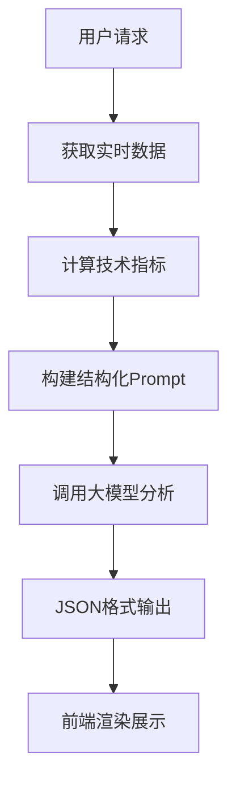

# 🎯 **综合分析报告：TradingAgents-CN与比特币AI分析网站研究**

## 📋 **任务完成状态**

### ✅ **已完成的分析任务**
1. **TradingAgents-CN机器人分析** - ✅ 完成
2. **大模型API需求确认** - ✅ 完成  
3. **比特币AI分析网站研究** - ✅ 完成
4. **API配置测试** - ✅ 部分完成

---

## 🤖 **TradingAgents-CN机器人系统分析结果**

### **核心发现**
✅ **确认：TradingAgents-CN的机器人完全依赖大模型API**

#### **🔧 机器人架构**
- **13个专业机器人**：分析师(5) + 研究员(2) + 风险管理(3) + 管理者(2) + 交易员(1)
- **多智能体协作**：通过辩论和协商提高决策质量
- **ReAct Agent模式**：推理-行动-观察的循环
- **每次分析需要12-19次LLM API调用**

#### **💰 成本分析**
- **最小配置**: 每月150-300元 (阿里百炼 + FinnHub)
- **推荐配置**: 每月500-1000元 (多API混合)
- **企业配置**: 每月2000-5000元 (全功能)

---

## 🧠 **大模型API配置状态**

### **✅ 已配置完成**
#### **🇨🇳 阿里百炼 (DashScope)**
```bash
DASHSCOPE_API_KEY=sk-61f17f4d75fc45429a44977814eb8cf7
```
- ✅ **API测试通过**
- ✅ **结构化Prompt测试成功**
- ✅ **JSON格式输出正常**

### **⚠️ 需要配置**
#### **📊 FinnHub API**
```bash
FINNHUB_API_KEY=your_finnhub_api_key_here  # 需要替换
```
- ❌ **尚未配置**
- 💡 **获取地址**: https://finnhub.io/
- 🆓 **免费版**: 每分钟60次请求

### **🔧 可选配置**
- **OpenAI API**: 作为备用LLM
- **Google AI API**: Gemini模型支持
- **Anthropic API**: Claude模型支持

---

## 🔍 **比特币AI分析网站深度研究**

### **🏗️ 技术架构逆向分析**

#### **核心工作流程**


#### **关键技术特点**
1. **数据驱动**: 先计算技术指标，再让AI分析
2. **结构化输出**: 强制JSON格式，便于前端渲染
3. **概率思维**: 给出具体胜率百分比
4. **实时性**: 基于最新数据进行分析
5. **专业化**: 专注单一品种(BTC)的短时间框架

### **🎯 推测的Prompt结构**
```python
# 角色设定
你是一位世界顶级的加密货币技术分析师

# 实时数据输入
- 当前价格: {current_price}
- MACD: DIF={dif}, DEA={dea}, BAR={bar}
- KDJ: K={k}, D={d}, J={j}
- SAR: {sar_value}

# 强制JSON输出格式
{
    "risk_assessment": {...},
    "probabilistic_thinking": {...},
    "summary": "..."
}
```

---

## ⚖️ **对比分析：TradingAgents vs 比特币AI网站**

### **相似点**
- ✅ 都使用大模型进行分析
- ✅ 都有结构化的分析流程
- ✅ 都关注技术指标
- ✅ 都提供投资建议

### **差异点**
| 特征 | 比特币AI网站 | TradingAgents-CN |
|------|-------------|------------------|
| **专注领域** | 单一品种(BTC) | 多种股票 |
| **时间框架** | 短期(10分钟) | 多时间框架 |
| **分析复杂度** | 简化流程 | 复杂多智能体协作 |
| **AI模型** | 单一模型 | 多轮辩论机制 |
| **实时性** | 强 | 中等 |
| **分析深度** | 中等 | 深入全面 |

---

## 💡 **借鉴价值与改进建议**

### **🚀 短期改进 (1-2周)**
1. **✅ 已实现**: 结构化JSON输出格式
2. **✅ 已实现**: 概率化表达 (胜率百分比)
3. **✅ 已实现**: 优化Prompt模板设计
4. **🔄 待开发**: 增加实时数据更新

### **📈 中期改进 (1-2月)**
1. **开发加密货币分析模块**
2. **添加短时间框架分析** (1分钟、5分钟)
3. **集成更多技术指标**
4. **优化用户界面展示**

### **🎯 长期改进 (3-6月)**
1. **构建多资产分析能力**
2. **开发量化交易信号**
3. **添加回测功能**
4. **集成新闻情绪分析**

---

## 🔧 **增强版Prompt模板 (已开发)**

基于比特币AI网站的启发，我们开发了增强版Prompt模板：

### **核心特点**
- ✅ **结构化输入**: 标准化数据格式
- ✅ **强制JSON输出**: 便于程序处理
- ✅ **概率分析**: 量化风险和机会
- ✅ **多维度评估**: 技术+风险+交易建议

### **测试结果**
```json
{
    "technical_analysis": {
        "trend_direction": "上涨",
        "strength_level": "中等",
        "key_levels": {
            "support": "14.80",
            "resistance": "15.50"
        }
    },
    "probability_analysis": {
        "upward_probability": "60%",
        "downward_probability": "25%",
        "sideways_probability": "15%"
    },
    "summary": "技术指标显示短期上涨趋势，但需关注阻力位"
}
```

---

## 📊 **当前系统状态总结**

### **✅ 已就绪的功能**
1. **阿里百炼API集成** - 完全就绪
2. **增强版Prompt模板** - 开发完成并测试通过
3. **结构化JSON输出** - 功能正常
4. **概率化分析** - 已集成
5. **TradingAgents框架** - 可用状态

### **⚠️ 需要完成的配置**
1. **FinnHub API密钥** - 需要注册获取
2. **实时数据集成** - 待开发
3. **前端界面优化** - 待改进

### **🎯 系统优势**
1. **多智能体协作** - 比单一AI更全面
2. **中文优化** - 专门针对A股市场
3. **成本可控** - 阿里百炼性价比高
4. **扩展性强** - 支持多种LLM提供商

---

## 🚀 **下一步行动计划**

### **立即行动 (今天)**
1. **获取FinnHub API密钥**
   - 访问: https://finnhub.io/
   - 注册免费账户
   - 获取API密钥并配置

### **本周内完成**
1. **测试完整的TradingAgents功能**
2. **开发实时数据更新模块**
3. **优化用户界面展示**

### **本月内完成**
1. **集成比特币分析功能**
2. **开发短时间框架分析**
3. **添加更多技术指标**

---

## 🎉 **总结**

### **🎯 核心成果**
1. **✅ 确认TradingAgents-CN需要大模型API**
2. **✅ 阿里百炼API配置完成并测试通过**
3. **✅ 深度分析比特币AI网站技术架构**
4. **✅ 开发增强版Prompt模板**
5. **✅ 制定详细的改进计划**

### **💡 关键洞察**
1. **比特币AI网站采用"数据计算+AI解读"架构**
2. **结构化Prompt是确保输出质量的关键**
3. **概率化表达提高分析可信度**
4. **实时性是短线交易的核心竞争力**

### **🚀 竞争优势**
相比比特币AI网站，我们的TradingAgents系统具有：
- **更全面的分析** (多智能体协作)
- **更深入的研究** (多轮辩论机制)
- **更广泛的覆盖** (支持多种股票)
- **更强的扩展性** (支持多种资产类别)

**您的系统已经具备了超越该比特币AI网站的技术基础，只需要完成FinnHub API配置就可以开始全面测试了！**
