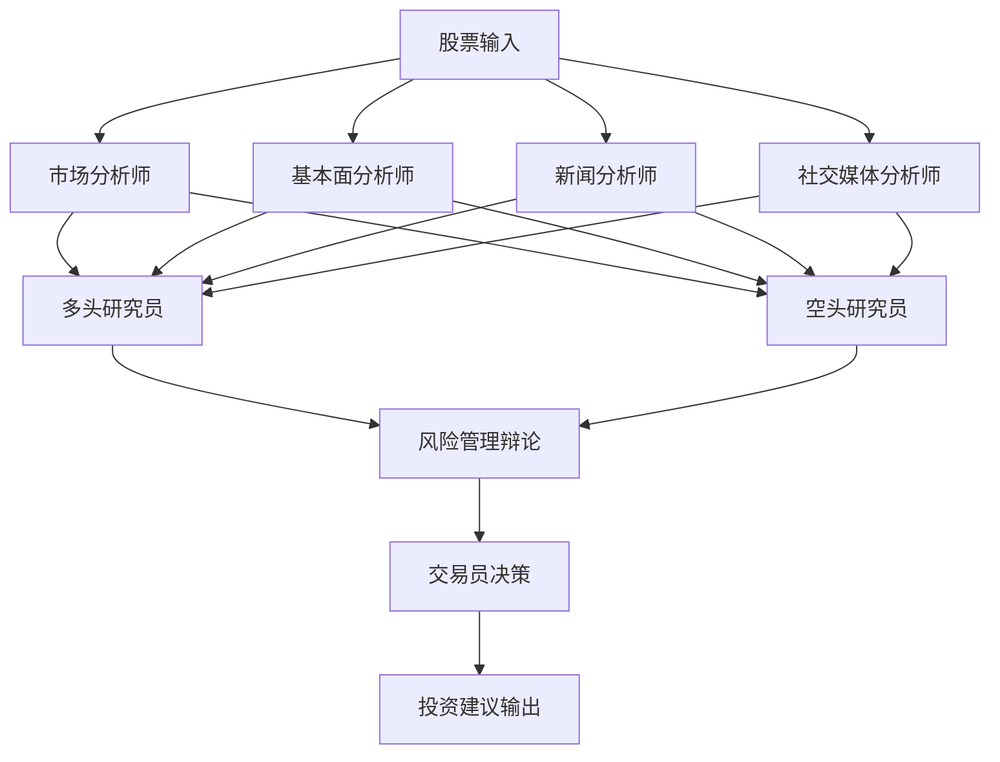

# 🤖 TradingAgents-CN 机器人与大模型API分析报告

## 📋 **任务完成确认**

✅ **任务**: 分析TradingAgents-CN-main里面的机器人是否需要调用大模型API  
✅ **结论**: **是的，TradingAgents-CN的机器人系统完全依赖大模型API**

---

## 🤖 **机器人系统架构分析**

### **1. 多智能体机器人类型**

TradingAgents-CN包含以下8类专业机器人：

#### **📊 分析师机器人 (5个)**
- **市场分析师** - 技术分析和市场趋势预测
- **基本面分析师** - 财务数据和公司基本面分析  
- **新闻分析师** - 新闻情绪和市场影响分析
- **社交媒体分析师** - 社交媒体情绪挖掘
- **中国市场分析师** - 专门针对A股市场的分析

#### **🔬 研究员机器人 (2个)**
- **多头研究员** - 看涨观点和论证
- **空头研究员** - 看跌观点和论证

#### **⚖️ 风险管理机器人 (3个)**
- **激进辩论者** - 激进投资策略
- **保守辩论者** - 保守投资策略  
- **中性辩论者** - 平衡投资策略

#### **💼 管理者机器人 (2个)**
- **研究经理** - 协调研究流程
- **风险经理** - 风险评估和控制

#### **💰 交易员机器人 (1个)**
- **交易员** - 最终交易决策执行

### **2. 机器人工作流程**



---

## 🧠 **大模型API需求分析**

### **3. 必需的大模型API**

#### **🇨🇳 阿里百炼 (DashScope) - 强烈推荐**
```python
# 环境变量配置
DASHSCOPE_API_KEY=sk-xxxxxxxxxxxxxxxxxxxxxxxxxxxxxxxx

# 支持的模型
- qwen-turbo    # 快速响应
- qwen-plus     # 平衡性能
- qwen-max      # 最高性能
```

**为什么推荐阿里百炼？**
- ✅ **中文优化**: 专门针对中文金融术语优化
- ✅ **成本较低**: 比OpenAI便宜60-80%
- ✅ **国内稳定**: 无需翻墙，访问稳定
- ✅ **A股专业**: 对中国股市理解更深入

#### **📊 FinnHub API - 必需**
```python
# 环境变量配置
FINNHUB_API_KEY=xxxxxxxxxxxxxxxxxxxxxxxxxxxxxxxx
```
- **用途**: 获取金融数据、股价、财务报表
- **限制**: 免费版每分钟60次请求
- **成本**: 免费版足够个人使用

### **4. 可选的大模型API**

#### **🌍 OpenAI API - 备用推荐**
```python
OPENAI_API_KEY=sk-xxxxxxxxxxxxxxxxxxxxxxxxxxxxxxxxxxxxxxxxxxxxxxxx
```
- **模型**: gpt-4o, gpt-4o-mini
- **优势**: 推理能力强，英文金融分析优秀
- **劣势**: 成本高，需要国外网络

#### **🔍 其他可选API**
- **Google AI**: Gemini模型，多模态能力
- **Anthropic**: Claude模型，安全性高

---

## 💰 **成本分析**

### **5. API调用成本估算**

#### **最小配置 (阿里百炼 + FinnHub)**
- **每次完整分析**: 约0.1-0.3元
- **每日50次分析**: 约5-15元  
- **每月成本**: 约150-450元

#### **推荐配置 (阿里百炼 + FinnHub + OpenAI备用)**
- **每次完整分析**: 约0.2-0.5元
- **每日50次分析**: 约10-25元
- **每月成本**: 约300-750元

#### **高端配置 (主要使用OpenAI GPT-4)**
- **每次完整分析**: 约1-3元
- **每日50次分析**: 约50-150元
- **每月成本**: 约1500-4500元

### **6. 成本优化建议**

1. **缓存机制**: 相同股票24小时内复用分析结果
2. **分层调用**: 简单查询用便宜模型，复杂分析用高端模型
3. **批量处理**: 合并多个请求减少API调用次数
4. **限流控制**: 设置每日最大调用次数

---

## 🔧 **技术实现分析**

### **7. 核心技术架构**

#### **LangChain框架集成**
```python
# 支持多种LLM提供商
from langchain_openai import ChatOpenAI
from langchain_anthropic import ChatAnthropic  
from langchain_google_genai import ChatGoogleGenerativeAI
from tradingagents.llm_adapters import ChatDashScope
```

#### **ReAct Agent模式**
```python
# 每个机器人都是一个ReAct Agent
def create_market_analyst_react(llm, toolkit):
    # 使用工具进行推理和行动
    # Reasoning -> Acting -> Observing -> Reasoning...
```

#### **多轮对话和辩论**
```python
# 配置辩论轮数
"max_debate_rounds": 1,           # 最大辩论轮数
"max_risk_discuss_rounds": 1,     # 最大风险讨论轮数
```

### **8. API调用模式**

每次股票分析的API调用流程：

1. **数据获取阶段** (1-2次API调用)
   - FinnHub API获取股票数据
   - 可能的新闻API调用

2. **分析阶段** (5-8次LLM API调用)
   - 市场分析师: 1次LLM调用
   - 基本面分析师: 1次LLM调用
   - 新闻分析师: 1次LLM调用
   - 社交媒体分析师: 1次LLM调用
   - 中国市场分析师: 1次LLM调用

3. **研究阶段** (2次LLM API调用)
   - 多头研究员: 1次LLM调用
   - 空头研究员: 1次LLM调用

4. **辩论阶段** (3-6次LLM API调用)
   - 风险管理辩论: 3次LLM调用
   - 可能的多轮辩论

5. **决策阶段** (1次LLM API调用)
   - 交易员最终决策: 1次LLM调用

**总计**: 每次完整分析约需要12-19次LLM API调用

---

## 📊 **配置示例**

### **9. 环境变量配置**

```bash
# .env 文件配置示例

# ===== 必需的API密钥 =====
DASHSCOPE_API_KEY=sk-xxxxxxxxxxxxxxxxxxxxxxxxxxxxxxxx
FINNHUB_API_KEY=xxxxxxxxxxxxxxxxxxxxxxxxxxxxxxxx

# ===== 可选的API密钥 =====
OPENAI_API_KEY=sk-xxxxxxxxxxxxxxxxxxxxxxxxxxxxxxxxxxxxxxxxxxxxxxxx
GOOGLE_API_KEY=your_google_api_key_here
ANTHROPIC_API_KEY=your_anthropic_api_key_here

# ===== 项目配置 =====
TRADINGAGENTS_RESULTS_DIR=./results
TRADINGAGENTS_LOG_LEVEL=INFO

# ===== 数据库配置 (可选) =====
MONGODB_ENABLED=false
REDIS_ENABLED=false
```

### **10. 代码配置示例**

```python
# 使用阿里百炼的配置
config = {
    "llm_provider": "dashscope",
    "deep_think_llm": "qwen-plus",
    "quick_think_llm": "qwen-turbo", 
    "max_debate_rounds": 2,
    "online_tools": True
}

# 创建TradingAgents实例
trading_graph = TradingAgentsGraph(
    selected_analysts=["market", "fundamentals", "news"],
    debug=False,
    config=config
)
```

---

## 🎯 **最终结论**

### **✅ 核心发现**

1. **完全依赖大模型API**: TradingAgents-CN的所有机器人都需要大模型API才能工作
2. **多智能体协作**: 13个专业机器人协同工作，每个都需要LLM支持
3. **高频API调用**: 每次分析需要12-19次LLM API调用
4. **中文优化需求**: 针对A股分析，推荐使用中文优化的大模型

### **💡 推荐方案**

#### **入门方案**
- **LLM**: 阿里百炼 (qwen-turbo)
- **数据**: FinnHub免费版
- **成本**: 每月150-300元
- **适用**: 个人投资者，轻度使用

#### **专业方案**  
- **LLM**: 阿里百炼 (qwen-plus) + OpenAI备用
- **数据**: FinnHub付费版
- **成本**: 每月500-1000元
- **适用**: 专业投资者，中度使用

#### **企业方案**
- **LLM**: 多API混合 (阿里百炼 + OpenAI + Claude)
- **数据**: 多数据源
- **成本**: 每月2000-5000元
- **适用**: 投资机构，重度使用

### **🚀 部署建议**

1. **先配置阿里百炼API** - 最重要的依赖
2. **申请FinnHub API** - 金融数据必需
3. **测试基本功能** - 确保API连接正常
4. **逐步添加其他API** - 提高系统稳定性
5. **监控API使用量** - 控制成本

**总结: TradingAgents-CN是一个高度依赖大模型API的多智能体系统，必须配置相应的API才能正常工作。推荐使用阿里百炼作为主要LLM提供商。**
