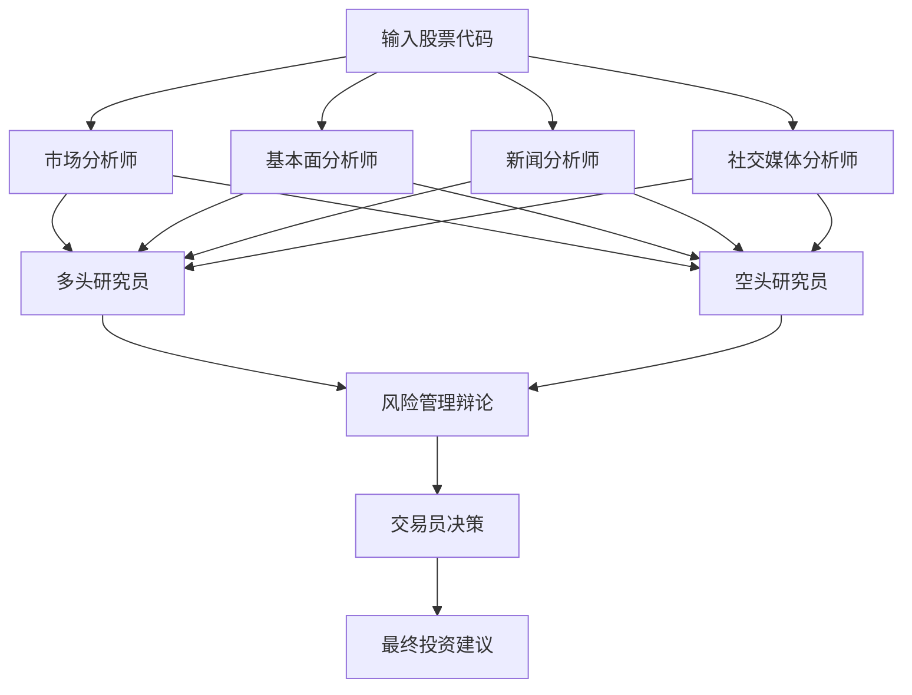

# TradingAgents-CN 机器人与大模型API分析报告

## 🤖 **机器人架构分析**

### **1. 多智能体系统架构**

TradingAgents-CN采用了多智能体协作的架构，包含以下核心机器人：

#### **📊 分析师机器人 (Analysts)**
- **市场分析师** (`market_analyst.py`) - 技术分析和市场趋势
- **基本面分析师** (`fundamentals_analyst.py`) - 财务数据和公司基本面
- **新闻分析师** (`news_analyst.py`) - 新闻情绪和市场影响
- **社交媒体分析师** (`social_media_analyst.py`) - 社交媒体情绪分析
- **中国市场分析师** (`china_market_analyst.py`) - 专门针对A股市场

#### **🔬 研究员机器人 (Researchers)**
- **多头研究员** (`bull_researcher.py`) - 看涨观点和论证
- **空头研究员** (`bear_researcher.py`) - 看跌观点和论证

#### **⚖️ 风险管理机器人 (Risk Management)**
- **激进辩论者** (`aggresive_debator.py`) - 激进投资策略
- **保守辩论者** (`conservative_debator.py`) - 保守投资策略
- **中性辩论者** (`neutral_debator.py`) - 平衡投资策略

#### **💼 管理者机器人 (Managers)**
- **研究经理** (`research_manager.py`) - 协调研究流程
- **风险经理** (`risk_manager.py`) - 风险评估和控制

#### **💰 交易员机器人 (Trader)**
- **交易员** (`trader.py`) - 最终交易决策执行

## 🧠 **大模型API需求分析**

### **2. 必需的大模型API**

#### **🇨🇳 阿里百炼 (DashScope) - 推荐**
```python
# 配置示例
DASHSCOPE_API_KEY=sk-xxxxxxxxxxxxxxxxxxxxxxxxxxxxxxxx
```
- **用途**: 主要LLM提供商，专门优化中文金融分析
- **模型**: qwen-turbo, qwen-plus, qwen-max
- **优势**: 中文理解能力强，适合A股分析
- **成本**: 相对较低，国内访问稳定

#### **📊 FinnHub API - 必需**
```python
# 配置示例
FINNHUB_API_KEY=xxxxxxxxxxxxxxxxxxxxxxxxxxxxxxxx
```
- **用途**: 获取金融数据和市场信息
- **功能**: 股价、财务数据、新闻、技术指标
- **限制**: 免费版每分钟60次请求

### **3. 可选的大模型API**

#### **🌍 OpenAI API - 可选**
```python
# 配置示例
OPENAI_API_KEY=sk-xxxxxxxxxxxxxxxxxxxxxxxxxxxxxxxxxxxxxxxxxxxxxxxx
```
- **模型**: gpt-4o, gpt-4o-mini
- **优势**: 推理能力强，英文金融分析优秀
- **劣势**: 需要国外网络，成本较高

#### **🔍 Google AI (Gemini) - 可选**
```python
# 配置示例
GOOGLE_API_KEY=your_google_api_key_here
```
- **模型**: gemini-pro, gemini-pro-vision
- **优势**: 多模态能力，图表分析
- **用途**: 辅助分析和验证

#### **🤖 Anthropic (Claude) - 可选**
```python
# 配置示例
ANTHROPIC_API_KEY=your_anthropic_api_key_here
```
- **模型**: claude-3-sonnet, claude-3-haiku
- **优势**: 安全性高，分析深度好
- **用途**: 风险评估和合规检查

## 🔧 **API配置与使用**

### **4. 核心配置文件分析**

#### **默认配置** (`default_config.py`)
```python
DEFAULT_CONFIG = {
    # LLM设置
    "llm_provider": "openai",           # 可选: openai, dashscope, google, anthropic
    "deep_think_llm": "o4-mini",        # 深度思考模型
    "quick_think_llm": "gpt-4o-mini",   # 快速思考模型
    "backend_url": "https://api.openai.com/v1",
    
    # 辩论设置
    "max_debate_rounds": 1,             # 最大辩论轮数
    "max_risk_discuss_rounds": 1,       # 最大风险讨论轮数
    
    # 工具设置
    "online_tools": True,               # 是否使用在线工具
}
```

#### **环境变量配置** (`.env`)
```bash
# 必需的API密钥
DASHSCOPE_API_KEY=your_dashscope_api_key_here
FINNHUB_API_KEY=your_finnhub_api_key_here

# 可选的API密钥
OPENAI_API_KEY=your_openai_api_key_here
GOOGLE_API_KEY=your_google_api_key_here
ANTHROPIC_API_KEY=your_anthropic_api_key_here

# 数据库配置（可选）
MONGODB_ENABLED=false
REDIS_ENABLED=false
```

### **5. 机器人工作流程**

#### **分析流程**


#### **API调用模式**
1. **数据获取**: FinnHub API → 获取市场数据
2. **分析处理**: 大模型API → 各智能体分析
3. **协作决策**: 大模型API → 智能体间辩论
4. **风险评估**: 大模型API → 风险管理
5. **最终决策**: 大模型API → 交易决策

## 💰 **成本与性能分析**

### **6. API成本估算**

#### **推荐配置 (阿里百炼)**
- **每次分析**: 约0.1-0.5元人民币
- **每日100次分析**: 约10-50元
- **每月成本**: 约300-1500元

#### **高端配置 (OpenAI GPT-4)**
- **每次分析**: 约1-5元人民币
- **每日100次分析**: 约100-500元
- **每月成本**: 约3000-15000元

### **7. 性能特点**

#### **优势**
- ✅ **多智能体协作**: 多角度分析，降低偏见
- ✅ **专业化分工**: 每个机器人专注特定领域
- ✅ **辩论机制**: 通过辩论提高决策质量
- ✅ **中文优化**: 专门针对中国市场优化

#### **挑战**
- ⚠️ **API依赖**: 高度依赖外部API服务
- ⚠️ **成本控制**: 大量API调用成本较高
- ⚠️ **延迟问题**: 多轮对话可能导致响应延迟
- ⚠️ **配额限制**: API调用频率限制

## 🚀 **部署建议**

### **8. 最小化配置**
```bash
# 仅使用必需的API
DASHSCOPE_API_KEY=your_key_here
FINNHUB_API_KEY=your_key_here

# 简化配置
max_debate_rounds=1
selected_analysts=["market", "fundamentals"]
```

### **9. 生产环境配置**
```bash
# 完整API配置
DASHSCOPE_API_KEY=your_key_here
FINNHUB_API_KEY=your_key_here
OPENAI_API_KEY=your_backup_key_here

# 优化配置
max_debate_rounds=2
selected_analysts=["market", "fundamentals", "news", "social"]
online_tools=true
```

## 📊 **总结**

### **✅ 机器人系统特点**
1. **多智能体架构** - 8种不同类型的专业机器人
2. **协作决策机制** - 通过辩论和讨论提高决策质量
3. **专业化分工** - 每个机器人专注特定分析领域
4. **中文优化** - 专门针对中国A股市场设计

### **🔑 API需求总结**
1. **必需API**: 阿里百炼(DashScope) + FinnHub
2. **可选API**: OpenAI + Google AI + Anthropic
3. **最低成本**: 每月约300-500元
4. **推荐配置**: 每月约1000-2000元

### **💡 使用建议**
1. **初期测试**: 使用阿里百炼 + FinnHub的最小配置
2. **生产部署**: 添加OpenAI作为备用，提高稳定性
3. **成本控制**: 设置API调用限制和缓存机制
4. **监控优化**: 实时监控API使用量和成本

**TradingAgents-CN是一个功能强大的多智能体金融分析系统，需要大模型API支持，但通过合理配置可以在控制成本的同时获得专业的投资分析能力。**
